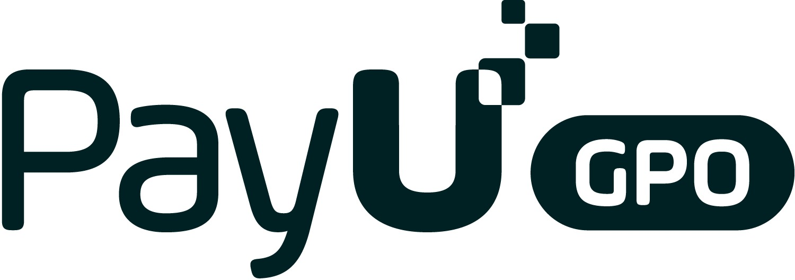

  

<h1 align="center">PayU dla Shopware 6 — dokumentacja</h1>

Integracja bramki płatniczej <strong>PayU</strong> ze sklepem <strong>Shopware 6</strong> — <strong>Bramka płatności PayU by CREHLER</strong>. 
BLIK (w tym Level 0), karty, pay-by-link, e-portfele, płatności odroczone (raty) oraz zwroty z panelu administratora.

---

## Od czego zacząć

| Dokument | Opis |
|---|---|
| 📦 **[Instalacja](instalacja.md)** | Dwie metody: Composer albo paczka ZIP — krok po kroku. |
| ⚙️ **[Konfiguracja](konfiguracja.md)** | Dane z panelu PayU (PosId, klucz MD5, OAuth), przypisanie metod do kanału sprzedaży, opcje karty, dane testowe (sandbox). |
| 🧩 **[Store API (headless)](store-api.md)** | Endpointy dla sklepów headless: BLIK Level 0, lista banków, status płatności. |
| ↩️ **[Zwroty płatności](zwroty.md)** | Pełne i częściowe zwroty z poziomu panelu Shopware. |

## Najważniejsze funkcje

- 🟢 **BLIK Level 0** — płatność kodem BLIK w sklepie, bez przekierowania.
- 💳 **Karta** — domyślnie redirect do PayU, opcjonalnie formularz osadzony w checkout; zapisane karty (tokeny).
- 🏦 **Pay-by-link** — wybór banku z listy; wybrany bank zapamiętywany na kolejne zamówienia.
- 👛 **E-portfele** — szybkie metody portfelowe obsługiwane przez PayU.
- 🗓️ **Płatności odroczone** — raty PayU / „Kup teraz, zapłać później".
- ↩️ **Zwroty** — pełne i częściowe, wprost z panelu Shopware.
- 🧩 **Headless** — pełne wsparcie Store API obok klasycznego Storefrontu.

## Wymagania (skrót)

Shopware **6.6/6.7**, PHP **8.2–8.5**, aktywne konto PayU z danymi punktu płatności (POS), waluta **PLN**. Szczegóły i instalacja: **[Instalacja](instalacja.md)**.

---

## Wsparcie

Masz pytanie? Napisz do nas: **[support@crehler.com](mailto:support@crehler.com)**

Bramka płatności <strong>PayU by CREHLER</strong> · <a href="https://crehler.com/">crehler.com</a>

