

  

<h1 align="center">PayU dla Shopware 6 — instrukcja konfiguracji</h1>

Bramka płatności PayU by CREHLER — krok po kroku: od danych z panelu PayU po gotowe płatności w sklepie.

---

> ℹ️ Instalację wtyczki (Composer lub ZIP) opisuje **[Instrukcja instalacji](instalacja.md)**. Ten dokument zakłada, że wtyczka jest już zainstalowana i aktywna.

---

## Zanim zaczniesz

Potrzebujesz:

- **aktywnego konta PayU** z danymi punktu płatności (do płatności produkcyjnych) lub **konta sandbox** (do testów),
- sklepu Shopware z kanałem sprzedaży obsługującym walutę **PLN**,
- zainstalowanej i aktywnej wtyczki **Bramka płatności PayU by CREHLER**.

> 💡 **Najpierw testy.** Zalecamy skonfigurowanie i przetestowanie płatności na danych **sandbox**, a dopiero potem przełączenie na produkcję.

---

## Krok 1 — Pobierz dane z panelu PayU

Zaloguj się do **Panelu zarządzania PayU** ([panel produkcyjny](https://secure.payu.com/) lub [panel sandbox](https://secure.snd.payu.com/)). Dane punktu płatności znajdziesz w sekcji **Płatności elektroniczne → Moje sklepy**. Masz dwie ścieżki — w zależności od tego, czy dodajesz nowy sklep, czy korzystasz z istniejącego.

### Wariant A — Dodaj nowy sklep

1. W panelu PayU wejdź w **Płatności elektroniczne → Moje sklepy → Dodaj sklep**.
2. **Krok 1 — dane sklepu:** podaj **adres** i **nazwę** sklepu.
3. **Krok 2 — sposób integracji:** wybierz **REST API (Checkout)** i podaj **nazwę punktu płatności**.
4. **Krok 3 — dane dostępowe:** skopiuj cztery wartości potrzebne we wtyczce (tabela niżej).

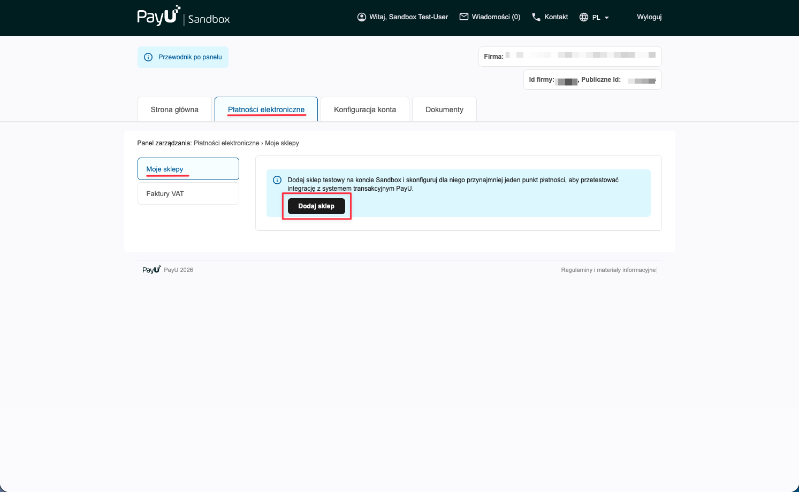

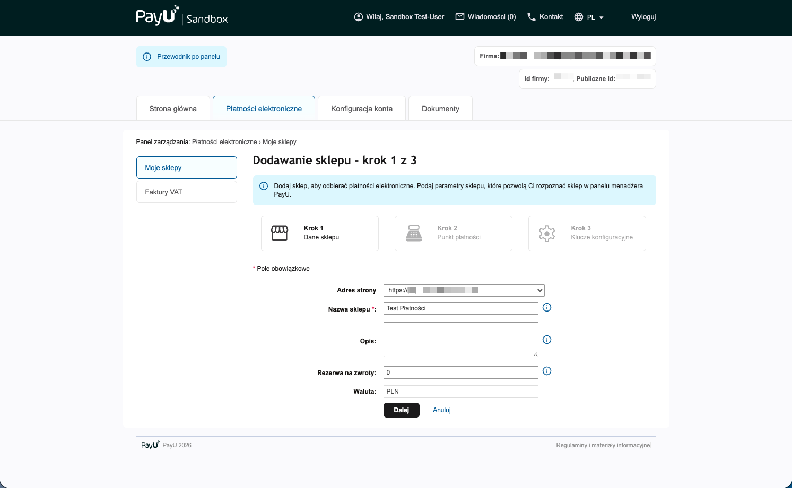

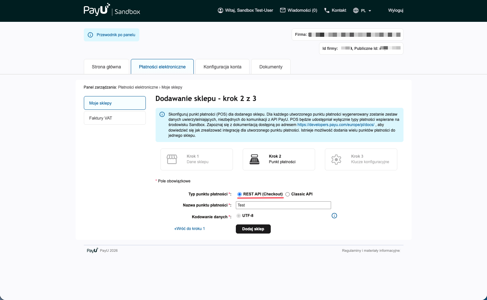

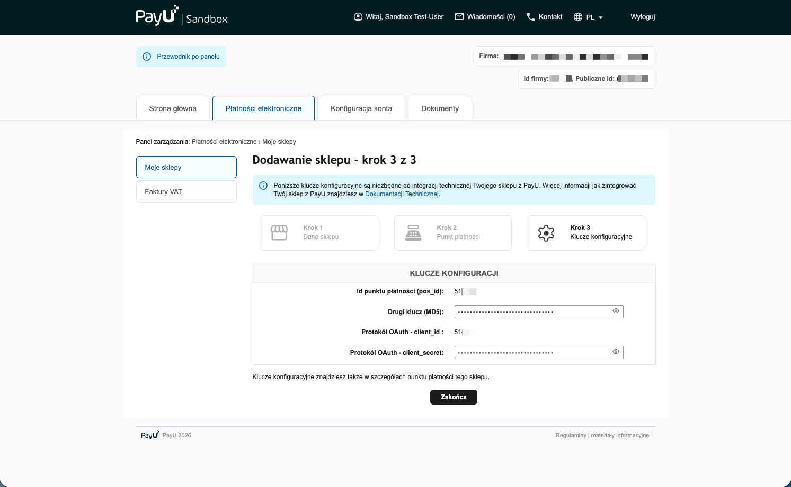

### Wariant B — Istniejący sklep

1. W panelu PayU wejdź w **Płatności elektroniczne → Moje sklepy** i przy wybranym sklepie kliknij **„Edytuj"**.
2. Przejdź do zakładki **Punkty płatności**, przy wybranym punkcie kliknij **„Edytuj"**, a następnie **„Zapisz zmiany"**.
3. Po zapisaniu panel wyświetli dane dostępowe punktu płatności (tabela niżej).

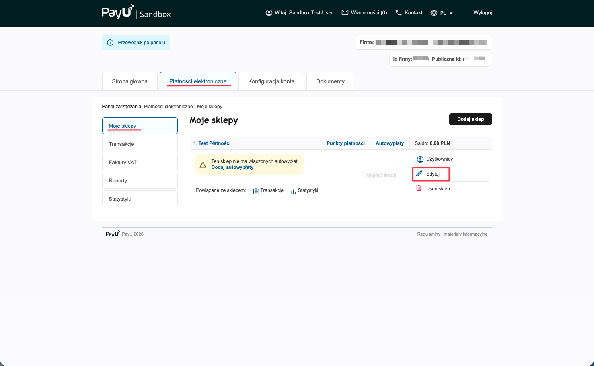

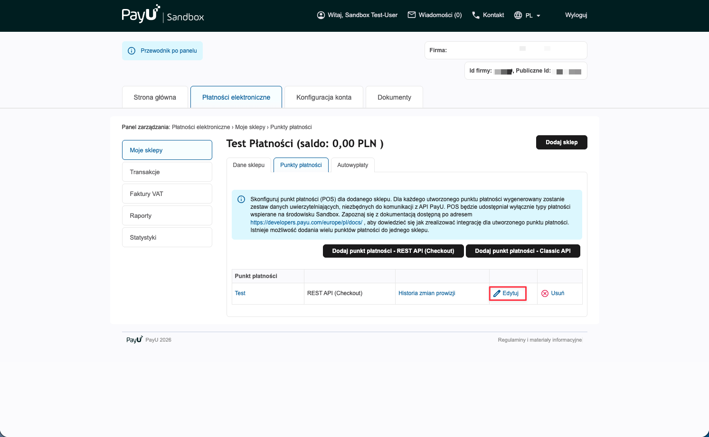

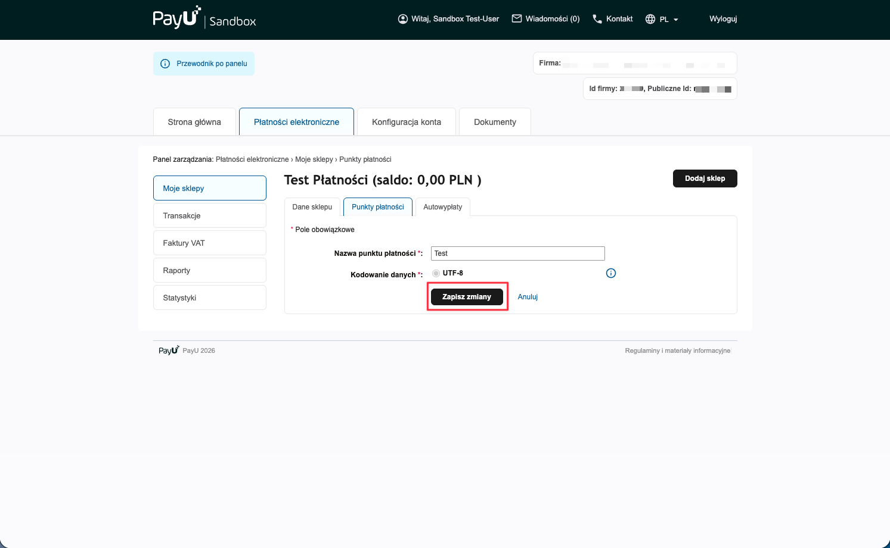

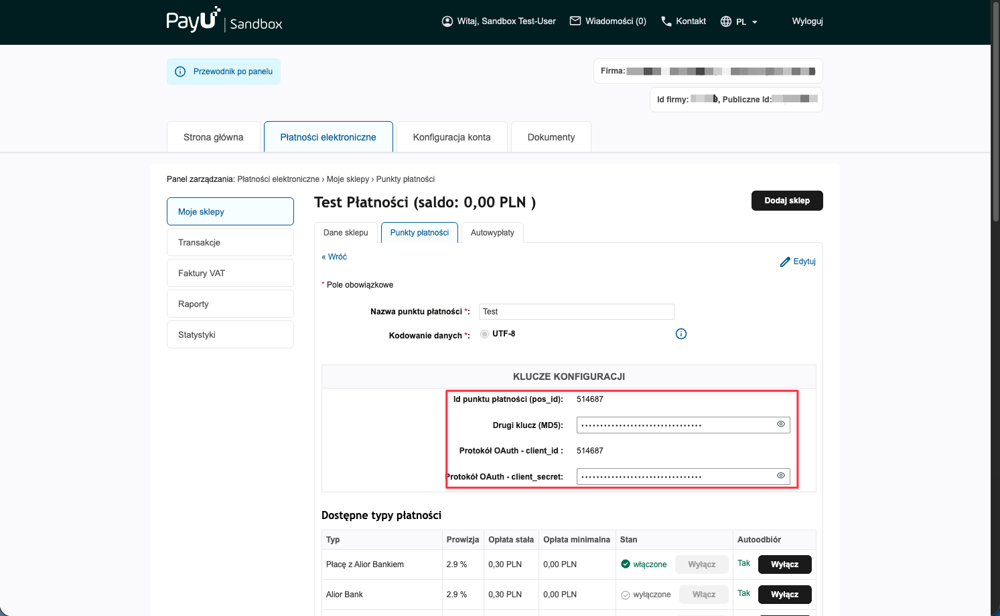

### Dane do skopiowania

| Dane w panelu PayU | Do czego służy |
|---|---|
| **Id punktu płatności (pos_id)** | identyfikuje punkt płatności w żądaniach do PayU |
| **Drugi klucz (MD5)** | wyliczanie i **weryfikacja podpisu** powiadomień (webhooków) o statusie płatności |
| **Protokół OAuth - client_id** | uwierzytelnianie wywołań API (zwykle równe `pos_id`) |
| **Protokół OAuth - client_secret** | sekret OAuth do uwierzytelniania API |

Te cztery wartości przenosisz **1:1** do konfiguracji wtyczki w Shopware (Krok 2) — pola w panelu PayU i we wtyczce nazywają się tak samo.

> 🧪 **Sandbox:** tę samą ścieżkę przejdziesz w [panelu sandbox PayU](https://secure.snd.payu.com/) — daje osobne wartości (pos_id / MD5 / client_id / client_secret). Wpisuje się je w osobną kartę „Konfiguracja Sandbox" w konfiguracji wtyczki.

---

## Krok 2 — Wpisz dane w konfiguracji wtyczki

W panelu Shopware przejdź do **Rozszerzenia → Moje rozszerzenia**, znajdź **Bramka płatności PayU by CREHLER** (musi być włączona — przełącznik po lewej) i kliknij **„Skonfiguruj"**.

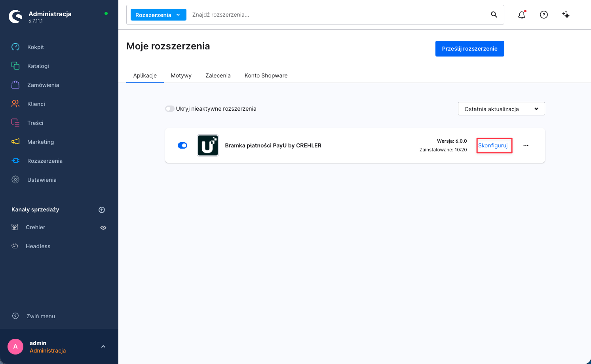

### 2a. Dane produkcyjne (Konfiguracja Produkcyjna)

Wypełnij kartę **Konfiguracja Produkcyjna** wartościami z **Kroku 1**:

| Pole w konfiguracji | Wartość z panelu PayU |
|---|---|
| **Id punktu płatności (pos_id)** | PosId punktu płatności |
| **Drugi klucz (MD5)** | drugi klucz (MD5) |
| **Protokół OAuth - client_id** | client_id (protokół OAuth) |
| **Protokół OAuth - client_secret** | client_secret (protokół OAuth) |

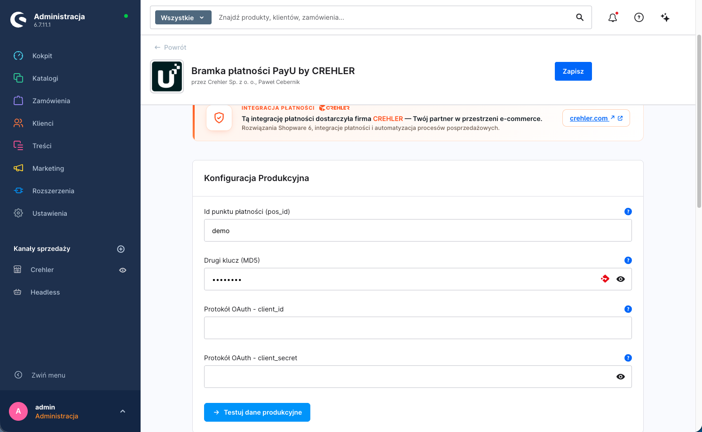

> ⚠️ **Wybór kanału sprzedaży.** U góry konfiguracji znajduje się przełącznik kanału sprzedaży. Ustawienia możesz zapisać globalnie („Wszystkie kanały sprzedaży") lub osobno dla wybranego kanału. Jeśli korzystasz z kilku kanałów z różnymi punktami płatności PayU — ustaw dane per kanał.

> 🛑 **Test połączenia NIE zapisuje danych!** Przycisk testu pod kartą jedynie sprawdza poprawność wpisanych danych — **nie zapisuje ich**. Aby zachować dane, po teście **osobno kliknij „Zapisz"** (prawy górny róg). Wyjście lub odświeżenie konfiguracji bez zapisania spowoduje utratę wpisanych danych.

### 2b. Dane sandbox (Konfiguracja Sandbox)

Aby płacić na koncie testowym, włącz **Włącz Sandbox** i wypełnij kartę **Konfiguracja Sandbox** danymi z [panelu sandbox PayU](https://secure.snd.payu.com/). Gdy tryb sandbox jest włączony, wtyczka używa danych sandbox zamiast produkcyjnych.

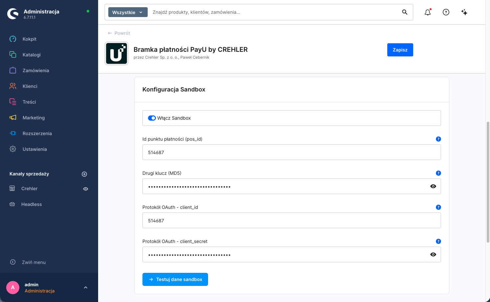

> 🛑 **Test połączenia NIE zapisuje danych!** Tak samo jak przy danych produkcyjnych — przycisk testu tylko weryfikuje dane sandbox. Aby je zachować, po teście **osobno kliknij „Zapisz"** (prawy górny róg).

### 2c. Przetestuj dane

Pod każdą kartą znajduje się przycisk testu połączenia. Kliknij go po wpisaniu danych — wtyczka połączy się z PayU i potwierdzi, że dane są poprawne.

> 🛑 **Pamiętaj: test to nie zapis.** Kliknięcie przycisku testu **nie zapisuje** wpisanych danych — sprawdza je tylko. Dopiero **„Zapisz"** (prawy górny róg) utrwala konfigurację. Wykonaj zapis osobno po udanym teście, zarówno dla danych produkcyjnych, jak i sandbox.

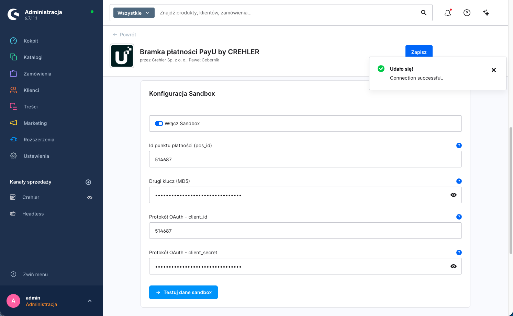

---

## Krok 3 — Przypisz płatności do kanału sprzedaży

Aby metody PayU (BLIK, karta, przelew, e-portfel, raty) były widoczne w checkout, muszą być **aktywne** i **przypisane do kanału sprzedaży**.

### 3a. Aktywuj metody płatności

**Ustawienia → Metody płatności** — upewnij się, że metody PayU są aktywne (przełącznik **„Aktywny"**). Wtyczka dodaje: **Karta**, **BLIK**, **Przelew online (pay-by-link)**, **E-portfel** i **Płatności odroczone** — każda opisana „… Bramka płatności PayU by CREHLER".

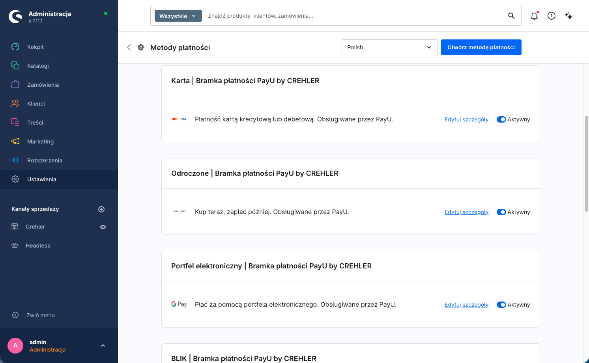

### 3b. Dodaj metody do kanału sprzedaży

W menu po lewej (sekcja **Kanały sprzedaży**) wybierz swój kanał. W sekcji **Płatność i wysyłka** → pole **Metody płatności** dodaj metody PayU, a w polu **Standardowa metoda płatności** możesz ustawić jedną z nich jako domyślną. Upewnij się też, że **Standardowa waluta** to **Złoty (PLN)**. Zapisz.

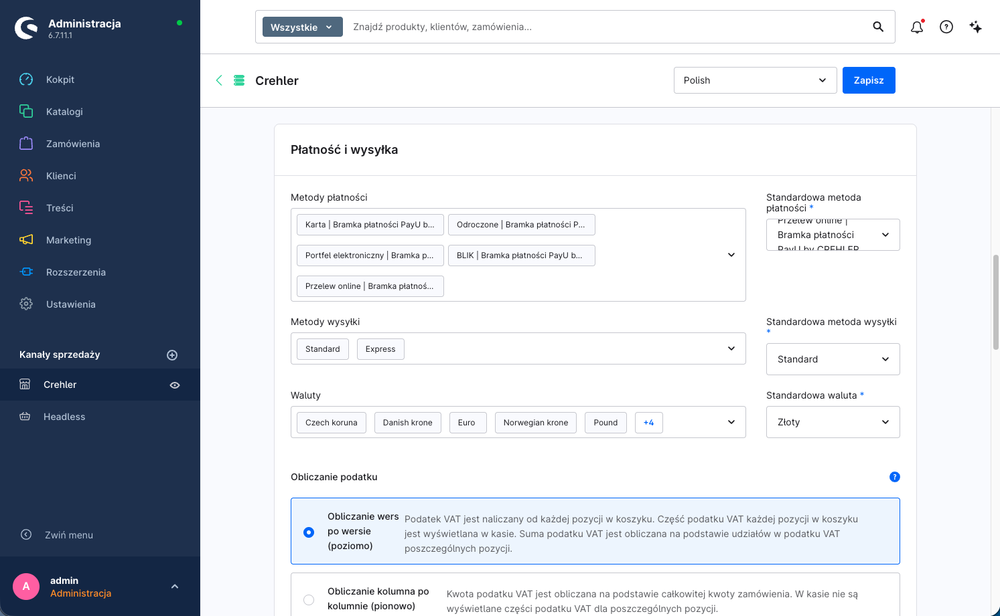

> 💡 Jeśli metoda nie pojawia się w checkout, sprawdź: czy jest aktywna (3a), czy dodana do kanału (3b), czy waluta koszyka to **PLN** oraz czy koszyk/kraj spełnia ewentualne reguły dostępności.

---

## Krok 4 — Konfiguracja płatności kartą

Płatność kartą w PayU działa domyślnie w modelu **przekierowania na bezpieczną stronę PayU** — klient **wpisuje dane karty (numer, datę, CVC) na stronie PayU**, nigdy w checkout Twojego sklepu. Wtyczka dokłada przy tym do konfiguracji wspólną kartę **Ustawienia wyświetlania**, w której decydujesz o wyglądzie checkoutu.

| Opcja | Działanie | Domyślnie |
|---|---|---|
| **Osadź formularz karty w checkout** | Wł.: w checkout pojawia się sekcja karty PayU — wybór **zapisanej karty**, opcja **„Zapisz kartę"** i informacja o przekierowaniu. Wył.: klient od razu przechodzi ścieżką przekierowania. **Dane karty są przejmowane przez bezpieczny mechanizm PayU** — wtyczka nie zapisuje numeru karty/CVC po stronie sklepu. | Wyłączone |
| **Pozycja pola kodu BLIK** | Gdzie pokazać pole na kod BLIK: *Na stronie potwierdzenia zamówienia* / *Na osobnej stronie po złożeniu* / *Ukryte (przekierowanie do bramki)*. | Na stronie potwierdzenia |

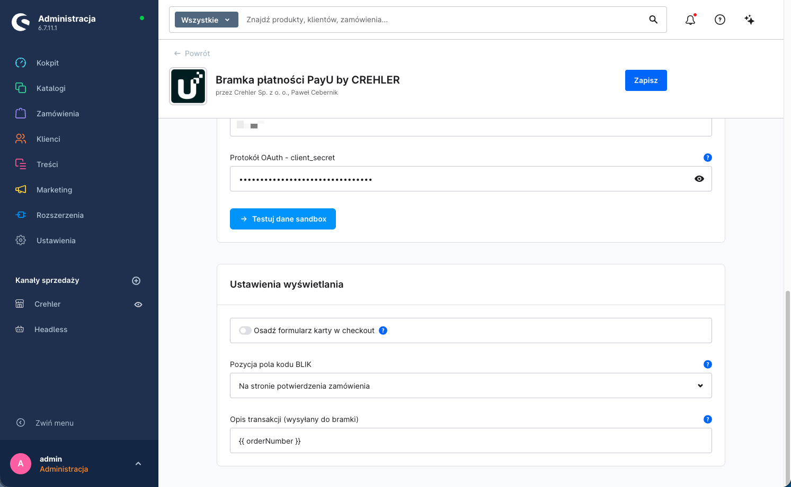

### Jak przebiega płatność kartą

Po kliknięciu **„Zamawiam i płacę"** klient zostaje przekierowany na **bezpieczną stronę PayU**, gdzie wpisuje dane karty i przechodzi ewentualne **3-D Secure**. Po zakończeniu wraca do sklepu, a status zamówienia aktualizuje się po potwierdzeniu od bramki.

> 🔐 **Zgodność (PCI DSS).** Dane karty są wpisywane **po stronie PayU** (przekierowanie na stronę bramki lub bezpieczny mechanizm tokenizacji PayU) i nie trafiają na serwer Twojego sklepu. To najniższy zakres wymogów PCI DSS — typowo **SAQ A**. W praktyce zadbaj jedynie o to, by sklep działał po **HTTPS**.

### Zapisane karty (tokeny)

Jeśli klient zaznaczy **„Zapisz kartę"**, PayU zapamiętuje kartę jako **token** powiązany z kontem klienta. Przy kolejnych zakupach klient wybiera zapisaną kartę z listy w checkout — płatność nadal finalizuje się po stronie PayU (token zamiast ponownego wpisywania danych).

---

## Krok 5 — Test płatności

1. Włącz **Włącz Sandbox** i zapisz konfigurację (Krok 2b).
2. Dodaj produkt do koszyka (waluta **PLN**) i przejdź do checkout.
3. Wybierz metodę PayU (np. **BLIK**) i dokończ zamówienie zgodnie z danymi testowymi PayU (poniżej).
4. Sprawdź w panelu Shopware, czy status płatności zamówienia zmienił się na **Opłacone** po potwierdzeniu.

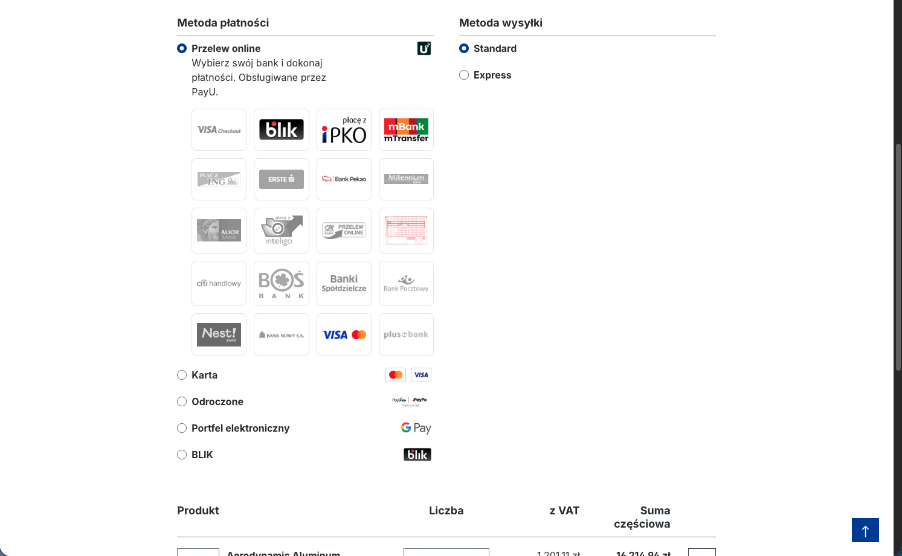

> ↩️ **Zwroty** wykonasz później z poziomu zamówienia w panelu Shopware — pełne lub częściowe, bez logowania do panelu PayU. Szczegóły: [Zwroty płatności](zwroty.md).

---

## Dane testowe (sandbox)

Środowisko sandbox PayU pozwala przejść pełną ścieżkę płatności bez realnych pieniędzy. Konto sandbox założysz w **[secure.snd.payu.com](https://secure.snd.payu.com/)**. Komplet aktualnych danych testowych (karty, 3-D Secure, scenariusze) znajdziesz w **[dokumentacji deweloperskiej PayU](https://developers.payu.com/)**.

### Karta — numer testowy

| Numer karty | CVV | Data ważności | Wynik |
|---|---|---|---|
| `4444 3333 2222 1111` | `123` | dowolna **przyszła** | płatność udana (bez 3-D Secure) |
| `5434 0212 0000 1211` | `123` | dowolna **przyszła** | płatność udana (Mastercard) |

### BLIK (sandbox)

W środowisku sandbox autoryzację BLIK realizujesz **6-cyfrowym kodem testowym** zgodnie z dokumentacją PayU — symulator pozwala wymusić powodzenie lub odrzucenie płatności.

> ℹ️ Dane testowe pochodzą z oficjalnej dokumentacji PayU i mogą się zmieniać. Aktualną, pełną listę (karty, kody 3-D Secure, scenariusze BLIK i pay-by-link) znajdziesz na **[developers.payu.com](https://developers.payu.com/)**.

> ⚠️ Po testach **wyłącz tryb sandbox** w konfiguracji wtyczki, aby płatności produkcyjne były realizowane poprawnie.

---

## Powiązane artykuły

- **[Integracja przez Store API (headless)](store-api.md)** — endpointy Store API (BLIK Level 0, sub-metody banków, sprawdzanie statusu) i przykłady użycia.
- **[Zwroty płatności](zwroty.md)** — pełne i częściowe zwroty z poziomu panelu Shopware.

---

## Wsparcie

Masz pytanie lub problem z konfiguracją? Napisz do nas: **[support@crehler.com](mailto:support@crehler.com)**

Bramka płatności <strong>PayU by CREHLER</strong> · <a href="https://crehler.com/">crehler.com</a>

