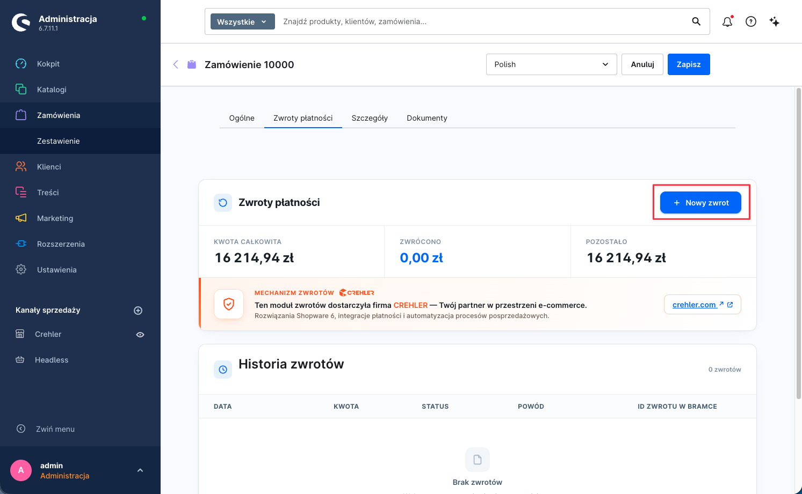
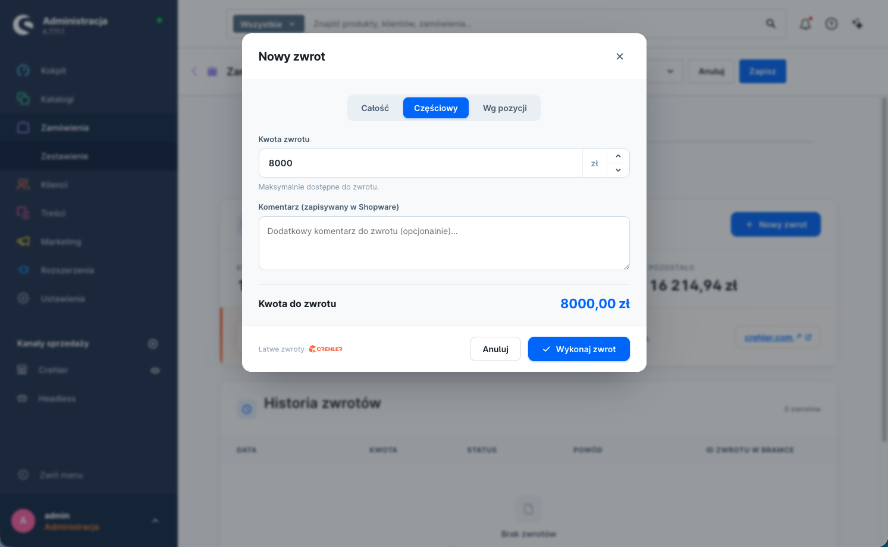
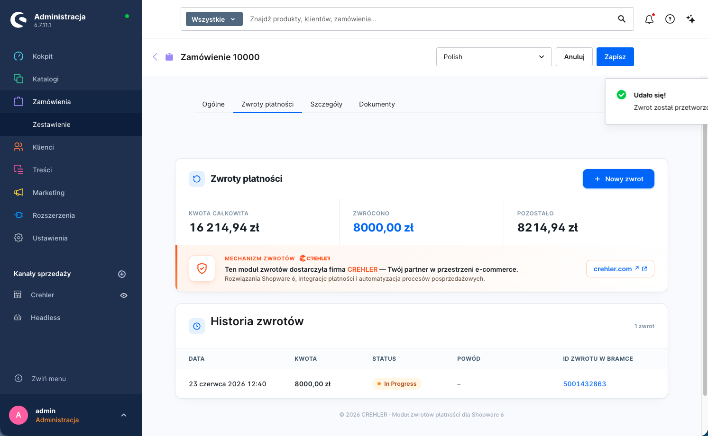

  

<h1 align="center">Zwroty płatności PayU</h1>

Pełne i częściowe zwroty pieniędzy klientowi — wykonywane wprost z panelu Shopware, bez logowania do panelu PayU.

---

> 📄 Konfigurację wtyczki opisuje [główna instrukcja](index.md). Ten dokument dotyczy zwracania środków za opłacone zamówienia.

## Wymagania

- Zamówienie musi być **opłacone** przez PayU.
- Dane punktu płatności (POS) użyte w konfiguracji wtyczki (produkcyjne lub sandbox) muszą mieć po stronie PayU włączoną obsługę **zwrotów**. Jeśli zwroty nie są aktywne dla danego POS, bramka odrzuci żądanie — skontaktuj się wtedy z PayU.

## Jak wykonać zwrot

**1. Otwórz zamówienie i przejdź do modułu „Zwroty płatności".**
W panelu admina: **Zamówienia** → wybierz zamówienie → zakładka **„Zwroty płatności"**. Widzisz tu podsumowanie (kwota całkowita / zwrócono / pozostało) oraz historię zwrotów. Kliknij **„+ Nowy zwrot"**, aby rozpocząć.

**2. Wybierz zakres zwrotu.**
W oknie **„Nowy zwrot"** wybierz tryb: **Całość**, **Częściowy** (konkretna kwota) lub **Wg pozycji** (zaznacz produkty i ilości). Możesz też podać **powód/opis zwrotu**. U dołu zobaczysz wyliczoną **Kwotę do zwrotu**.

**3. Wykonaj zwrot.**
Kliknij **„Wykonaj zwrot"**. Zwrot zostaje wysłany do PayU, a jego stan zmienia się automatycznie w miarę przetwarzania.

## Statusy zwrotu

Zwrot ma własny cykl życia (niezależny od statusu samej transakcji):

| Status | Znaczenie |
|---|---|
| **Otwarty** (open) | Zwrot utworzony, jeszcze nieprzetworzony |
| **W toku** (in progress) | Wysłany do bramki, oczekuje na realizację |
| **Zakończony** (completed) | Środki zwrócone klientowi |
| **Nieudany** (failed) | Bramka odrzuciła zwrot |
| **Anulowany** (cancelled) | Zwrot wycofany przed realizacją |

Po zsumowaniu zwrotów status **zamówienia** odzwierciedla „zwrócone" / „częściowo zwrócone".

## Zwroty częściowe i wielokrotne

Możesz zwrócić część kwoty, a później kolejną — aż do sumy nieprzekraczającej wartości opłaconej transakcji. Każdy zwrot jest osobnym wpisem z własnym statusem, kwotą, powodem i datą, co daje czytelny audyt „co, kiedy i ile" zostało zwrócone.

## Zwroty wykonane w panelu PayU

Jeśli zwrot zostanie wykonany **ręcznie w panelu PayU** (poza sklepem), wtyczka odbierze powiadomienie (webhook) i **zsynchronizuje** stan zwrotu w Shopware, aby widok zamówienia pozostał spójny.

## Uwagi

- Zwrot nie cofa samej wysyłki/zamówienia — to wyłącznie zwrot **środków**.
- Czas zaksięgowania zwrotu po stronie banku/operatora zależy od PayU i banku klienta.

---

## Wsparcie

Problem ze zwrotem? Napisz do nas: **[support@crehler.com](mailto:support@crehler.com)**

Bramka płatności <strong>PayU by CREHLER</strong> · <a href="https://crehler.com/">crehler.com</a>

